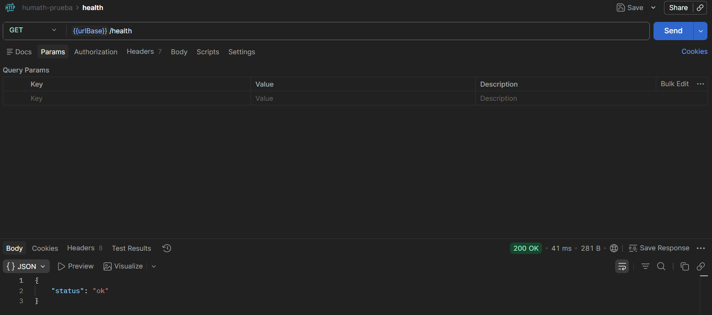
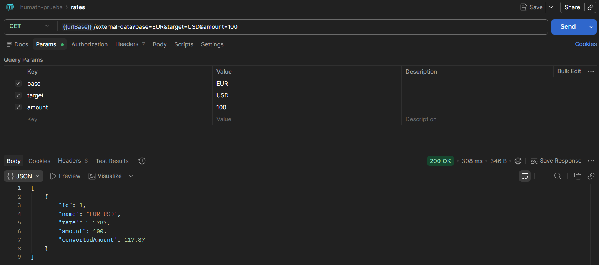

# HuMath (Prueba técnica)

API REST en **Node.js + Express** que consume Frankfurter (API de divisas), transforma datos y expone `GET /external-data`.

## Objetivo de la prueba

- Exponer un endpoint funcional (`/external-data`).
- Exponer un endpoint de salud (`/health`).
- Consumir una API externa y retornar el formato esperado.
- Documentar ejecución local.
- Explicar despliegue en Azure con **App Service + GitHub Actions**.
- Incluir (de forma informativa) carga de archivos a Azure Storage con SAS.

## Alcance técnico de esta prueba (sin base de datos)

Esta solución no usa base de datos porque el alcance de la prueba está centrado en:

- Consumo de API externa.
- Transformación de datos.
- Exposición de endpoints REST.
- Despliegue en Azure.

Por ese motivo:

- No se implementa TypeORM ni migraciones.
- No hay persistencia de datos.
- Las “entities” (si se usan) son únicamente para tipado/estructura en memoria, no para almacenamiento.

## Requisitos para correr el código

- **Node.js** 18 o superior.
- **npm** 9 o superior.
- **PowerShell** (para `Copy-Item`) en Windows
- Puerto **3000** disponible.
- Acceso a internet para consumir `https://api.frankfurter.dev`.

## Cómo ejecutarlo localmente

```bash
npm install
Copy-Item .env.example .env
npm run dev
```

API local:
- `http://localhost:3000`

API en Azure:
- `https://humath-prueba-b3cgebh8esf8h9ap.canadacentral-01.azurewebsites.net`

## Endpoints

### 1) Health

### Local

```bash
GET http://localhost:3000/health
```

### Azure

```bash
GET https://humath-prueba-b3cgebh8esf8h9ap.canadacentral-01.azurewebsites.net/health
```

Respuesta esperada:

```json
{
  "status": "ok"
}
```



### 2) External data

### Local

```bash
GET http://localhost:3000/external-data?base=EUR&target=USD&amount=100
```

### Azure

```bash
GET https://humath-prueba-b3cgebh8esf8h9ap.canadacentral-01.azurewebsites.net/external-data?base=EUR&target=USD&amount=100
```

Respuesta esperada:

```json
[
  {
    "id": 1,
    "name": "EUR-USD",
    "rate": 1.1787,
    "amount": 100,
    "convertedAmount": 117.87
  }
]
```


## API externa usada

- Frankfurter: [https://frankfurter.dev/](https://frankfurter.dev/)
- Endpoint consumido: `https://api.frankfurter.dev/v2/rates`

---

## Azure: despliegue con App Service + GitHub Actions

Referencia base:  
- [Implementación en App Service mediante GitHub Actions](https://learn.microsoft.com/es-es/azure/app-service/deploy-github-actions?tabs=openid%2Caspnetcore)

### Flujo propuesto para esta prueba

1. Crear una **Web App (Azure App Service)** para Node.js.
2. Subir el proyecto a GitHub.
3. En Azure Portal, abrir la Web App > **Deployment Center**.
4. Seleccionar **GitHub Actions** como método de despliegue.
5. Conectar repositorio y rama principal.
6. Azure genera el workflow en `.github/workflows/`.
7. Cada push a la rama configurada dispara build y deploy automático.

### Variables de entorno (App Service)

Configurar en **App Service > Configuration > Application settings**:

- `PORT=3000`
- `FRANKFURTER_API_URL=https://api.frankfurter.dev`

Si se habilita carga de archivos:

- `AZURE_STORAGE_ACCOUNT_NAME=<storage-account>`
- `AZURE_STORAGE_ACCOUNT_KEY=<storage-key>`
- `AZURE_STORAGE_CONTAINER=<container-name>`

> No subir secretos al repositorio. Usar App Settings, Secrets de GitHub y/o Azure Key Vault.

### URL pública de la aplicación

Después del despliegue, la API queda disponible en:

- `https://humath-prueba-b3cgebh8esf8h9ap.canadacentral-01.azurewebsites.net/external-data?base=EUR&target=USD&amount=100`
- `https://humath-prueba-b3cgebh8esf8h9ap.canadacentral-01.azurewebsites.net/health`

---

## Nota informativa: carga de archivos a Azure Storage con SAS

Para una implementación segura:

1. El backend genera un **SAS token** temporal con permisos limitados.
2. El cliente recibe la URL SAS y sube directamente a Blob Storage.
3. La `AZURE_STORAGE_ACCOUNT_KEY` no se expone en frontend.
4. Se limita expiración, tipo y tamaño de archivo.
